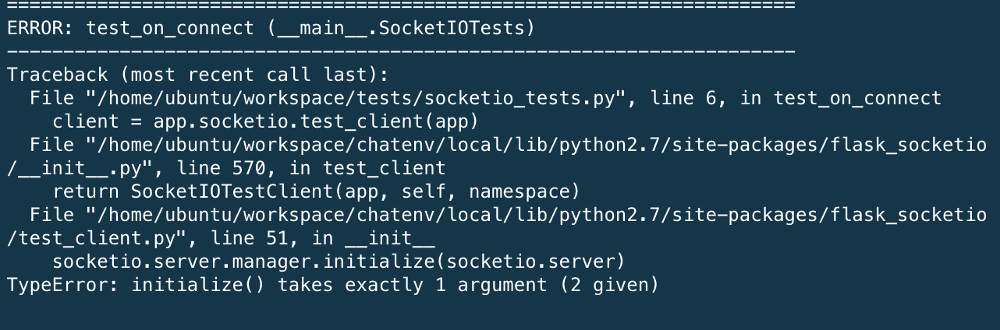

# project2-h2-ddavignon

## What is the theme you'll be using for Project 2?

 I went for a modern material design theme.

## How did you incorporate the theme using APIs, your bot, and styling, wihtin your project?
 
 For handin 2 I incorporated a Chuck Norris API 'https://api.chucknorris.io/' that I found on Mashape 'https://market.mashape.com/matchilling/chuck-norris'. I chose to use the random link
 because I felt it best suited my project. The rest of the app is similiar to handin 1, as I continue 
 to use the Materil-UI library for the majority of my components. I wanted to create something that was fun to look at, and I found a background of SF that I liked, so I incorporated that as well.

## What are known problems, if any, with your project?

 I don't have enough socketio tests. I was having trouble with the testing and kept
 getting an unusual error. I ended up upgrading Flask-SocketIO  from 2.8.2 to the latest version 2.8.5. I was able to add two socketio_tests and will add more if I get the time to work on the project more.
 

 

 From handin 1:
 
 -- I am having trouble getting the chat list to load on the bottom without overflow. I think it is an issue with the Material-UI List components. No Google Sign In...

## How would you improve if you had more time?

 
I would improve the UI of the chat list when a new message is entered. I would also add in Google Sign in. The user connected can be a little buggy testing with the same user across multiple browsers.

# I **OPT OUT** of Improvements from handin 1

